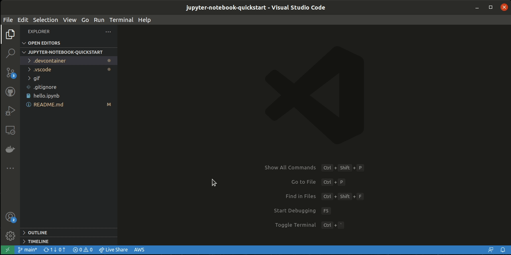

# jupyter-notebook-quickstart

---

# Requirement
- VSCode
- "Remote - Containers" plugin (`ms-vscode-remote.remote-containers`)

# Setup
1. Fork this repo and open in VSCode.
2. Press F1  
    -> choose `Remote-Containers:Reopen in Container`
3. Copy the server URL displayed on the console
> You can even confirm it by entering `jupyter notebook list` on terminal.
4. Press F1  
    -> choose `Jupyter: Specify local or remote Jupyter server for connections`  
    -> choose `Existing`  
    -> The URL you just copied will be pasted automatically, so press Enter.
5. Press F1
    -> Click the `Reload` button that appears in the pop-up at the bottom right

---

# 前提条件
- VSCode
- "Remote - Containers" plugin (`ms-vscode-remote.remote-containers`)

# セットアップ手順
1. このリポジトリをフォークし、VSCodeで開く
2. F1を押す  
    -> `Remote-Containers:Reopen in Container` を選択
3. VSCodeのコンソールに表示されるサーバーURLをコピーする
> ターミナルで `jupyter notebook list` を入力することで再確認できます
4. F1を押す  
    -> `Jupyter: Specify local or remote Jupyter server for connections` を選択  
    -> `Existing` を選択  
    -> 先程コピーしたURLが自動でペーストされるため、Enterを押します
5. 右下のポップアップに出てくる `Reload` ボタンをクリックします
